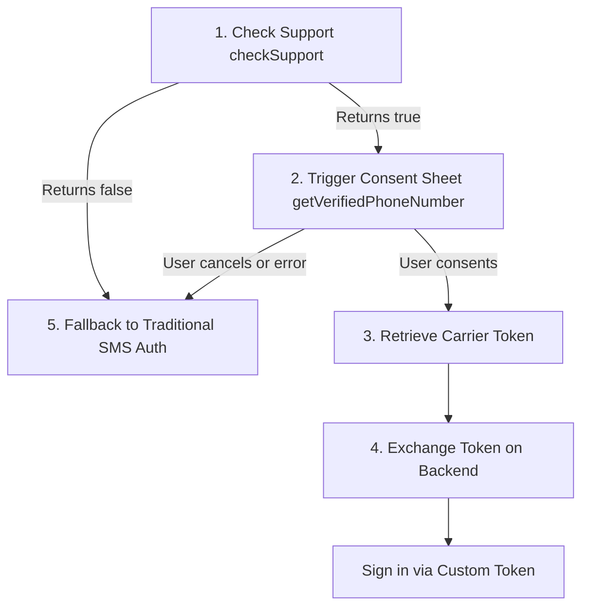

# firebase_pnv

<p align="center">
  
</p>

<p align="center">
  <a href="https://pub.dev/packages/firebase_pnv"></a>
  <a href="https://github.com/r4khul/firebase_pnv"></a>
  <a href="https://github.com/r4khul/firebase_pnv/actions/workflows/ci.yml"></a>
  <a href="https://opensource.org/licenses/MIT"></a>
</p>

**firebase_pnv** is an unofficial Flutter bridge wrapping Google's carrier-based **Firebase Phone Number Verification (PNV)** SDK. It allows Android applications to verify a user's phone number directly with their mobile carrier with **zero SMS costs**, **no SMS verification codes**, and **absolute protection against SMS pumping fraud**.

---

## What is Firebase PNV

This package is **NOT** the traditional, SMS-based Firebase Phone Authentication (`firebase_auth`). Instead, it is a modern, carrier-integrated verification flow:

* **No SMS Verification Codes:** The user does not need to wait for a 6-digit OTP code, open their SMS app, or type anything.
* **Direct SIM/Carrier Lookup:** Verification is handled silently and securely in the background by communicating directly with the mobile carrier via the **Carrier API** (integrated into Google Play Services & Android Credential Manager).
* **Zero SMS Costs:** Since no text messages are sent, there are no SMS dispatch fees or carrier charges.
* **Immune to SMS Pumping Fraud:** Traditional SMS verification is vulnerable to toll fraud/pumping, where malicious bots trigger OTPs to premium rate numbers. Because `firebase_pnv` does not send SMS messages, it is completely immune to this attack vector.

| Feature | `firebase_pnv` (This Package) | Traditional Firebase Phone Auth |
| :--- | :--- | :--- |
| **Verification Method** | Carrier / SIM (Carrier API) | SMS OTP Code |
| **User Action** | Tap "Allow" on native system sheet | Read SMS, manually input 6-digit code |
| **SMS Pumping Risk** | **None** (No SMS sent) | Vulnerable to toll fraud & bot abuse |
| **Verification Speed** | Instant/Near-Instant | Dependent on network/SMS delivery times |
| **SMS Cost** | **$0.00** | Varies by country (can be expensive) |
| **Platform Support** | Android-only (SDK dependency) | Android, iOS, Web |
| **Auth Integration** | Yields a signed token; backend exchanges it for a Custom Token | Yields a native Firebase Auth credential |

---

## Platform Support

* **Android:** Full implementation. Requires **Google Play Services** on the device. It integrates with Android's **Credential Manager** to present the native consent dialog.
* **iOS / macOS / Windows / Linux / Web:** Firebase Phone Number Verification is a native Android-only SDK provided by Google. To ensure your multiplatform Flutter apps build and run without breaking, this package includes **safe platform stubs**.
  * Calling `checkSupport()` on non-Android platforms safely returns `false` instead of throwing.
  * Attempting native calls like `getVerifiedPhoneNumber()` on other platforms throws a `PlatformException` with the code `UNAVAILABLE`.
  * This architecture allows you to write single-codebase Flutter auth logic that checks support and cleanly falls back to traditional SMS authentication where PNV is unavailable.

---

## How to Use This Package

### Installation

Add `firebase_pnv` to your `pubspec.yaml`:

```yaml
dependencies:
  firebase_pnv: ^1.0.1
```

### Android Setup

1. **Add Firebase to Android:** Add Firebase to your Android project if you haven't already ([Firebase Setup Guide](https://firebase.google.com/docs/android/setup)).
2. **Enable PNV:** Go to the [Firebase Console](https://console.firebase.google.com), open your project, and enable Phone Number Verification under your Auth settings.
3. **Configure Gradle:**
   * Your project's Android `minSdkVersion` must be set to **24** (Android 7.0) or higher.
   * The plugin handles importing the native dependency:
     ```kotlin
     implementation(platform("com.google.firebase:firebase-bom:34.15.0"))
     implementation("com.google.firebase:firebase-pnv")
     ```
     No additional dependencies are needed in your app-level `build.gradle`.

### iOS Setup

No setup is required. The package provides a stub that allows iOS compilations to complete normally. Ensure you use `checkSupport()` before invoking PNV methods to provide a clean SMS fallback for your iOS users.

### Screenshots

Here is the native Credential Manager consent sheet and the carrier verification flow on an Android device:

<p align="center">
  
  &nbsp;&nbsp;&nbsp;&nbsp;
  
</p>

### Integration Flow

The usage flow of Firebase PNV consists of 5 core steps:



### Code Implementation

Here is how to combine PNV and SMS fallbacks in a single cohesive flow:

```dart
import 'package:firebase_pnv/firebase_pnv.dart';
import 'package:firebase_auth/firebase_auth.dart';

final _firebasePnv = FirebasePnv();

Future<void> startAuthentication(String phoneNumberInput) async {
  // 1. Check capability
  final bool isPnvSupported = await _firebasePnv.checkSupport();

  if (isPnvSupported) {
    try {
      // 2 & 3. Trigger sheet and retrieve token
      final result = await _firebasePnv.getVerifiedPhoneNumber();
      final String? pnvToken = result?['token'] as String?;

      if (pnvToken != null) {
        // 4. Exchange PNV token on your backend for a Firebase Custom Token
        final String customToken = await exchangePnvTokenWithBackend(pnvToken);
        
        // Sign in user
        await FirebaseAuth.instance.signInWithCustomToken(customToken);
        return;
      }
    } catch (e) {
      // 5. User cancelled or carrier lookup failed. Fall through to SMS.
      print("Firebase PNV failed: $e. Falling back to SMS Auth.");
    }
  }

  // Fallback: standard Firebase SMS OTP verification
  await FirebaseAuth.instance.verifyPhoneNumber(
    phoneNumber: phoneNumberInput,
    verificationCompleted: (PhoneAuthCredential credential) async {
      await FirebaseAuth.instance.signInWithCredential(credential);
    },
    verificationFailed: (FirebaseAuthException e) {
      print("SMS Verification failed: ${e.message}");
    },
    codeSent: (String verificationId, int? resendToken) {
      // Prompt user to enter OTP code
    },
    codeAutoRetrievalTimeout: (String verificationId) {},
  );
}
```

### Backend Token Exchange

Firebase Auth does not accept PNV carrier tokens directly on the client. You must exchange them on your backend.

Here is a Node.js Express server example demonstrating verification and token exchange:

```javascript
// server.js - Node.js + Express + firebase-admin
const express = require('express');
const admin = require('firebase-admin');
const { JwtVerifier } = require('aws-jwt-verify');

admin.initializeApp();

// Find your Firebase project number on Settings > General in the console.
const FIREBASE_PROJECT_NUMBER = '123456789';
const issuer = `https://fpnv.googleapis.com/projects/${FIREBASE_PROJECT_NUMBER}`;
const audience = issuer;
const jwksUri = 'https://fpnv.googleapis.com/v1beta/jwks';

// Verifier checks signature (ES256, via JWKS), issuer, audience, and expiration.
const fpnvVerifier = JwtVerifier.create({ issuer, audience, jwksUri });

const app = express();
app.use(express.json());

app.post('/api/verify-pnv', async (req, res) => {
  const { pnvToken } = req.body;
  if (!pnvToken) return res.status(400).send('Missing token');

  try {
    // 1. Verify the carrier-signed token
    const payload = await fpnvVerifier.verify(pnvToken);

    // 2. Extract verified phone number from subject
    const verifiedPhoneNumber = payload.sub;

    // 3. Find or create Firebase User
    let user;
    try {
      user = await admin.auth().getUserByPhoneNumber(verifiedPhoneNumber);
    } catch (err) {
      user = await admin.auth().createUser({ phoneNumber: verifiedPhoneNumber });
    }

    // 4. Mint a custom authentication token
    const customToken = await admin.auth().createCustomToken(user.uid);

    return res.json({ customToken });
  } catch (err) {
    console.error('Token verification failed:', err);
    return res.status(400).send('Invalid verification token');
  }
});

app.listen(3000, () => console.log('Auth backend listening on port 3000'));
```

---

## API Reference

Here is a showcase of the classes and methods available in the `firebase_pnv` package.

### FirebasePnv Class

The main class to interact with the Firebase Phone Number Verification SDK.

#### `checkSupport()`

Checks whether the current device, SIM card, and network carrier support Firebase Phone Number Verification.

* **Type:** `Future<bool>`
* **Returns:** `true` if the carrier lookup is supported on this device/SIM combination. Returns `false` on unsupported devices, unsupported network carriers, or non-Android platforms (e.g. iOS, Web).
* **Usage:**
  ```dart
  final _firebasePnv = FirebasePnv();
  bool isSupported = await _firebasePnv.checkSupport();
  ```

#### `getVerifiedPhoneNumber()`

Runs the full verification flow. On Android, this triggers the Credential Manager consent bottom sheet. If the user consents, the library verifies the phone number directly with the mobile carrier in the background.

* **Type:** `Future<Map<String, dynamic>?>`
* **Returns:** `null` if the native platform returned no result, or a map containing:
  * `phoneNumber`: The verified E.164 phone number.
  * `token`: The carrier-signed verification token (JWT) to send to your backend for verification.
* **Throws:** `PlatformException` if the user cancels, if the device/carrier is unsupported, or if it runs on a non-Android platform.
* **Usage:**
  ```dart
  try {
    final result = await _firebasePnv.getVerifiedPhoneNumber();
    if (result != null) {
      String? phoneNumber = result['phoneNumber'];
      String? token = result['token'];
    }
  } on PlatformException catch (e) {
    // Handle error or user cancellation, and fall back to SMS
  }
  ```

#### `enableTestSession(String token)`

Enables a mock test session for testing carrier-based verification locally or on emulators.

* **Type:** `Future<void>`
* **Parameters:** `token` (String) - The verification token generated from the Firebase Console (under Security > Phone Verification > Testing).
* **Behavior:** When active, `getVerifiedPhoneNumber()` resolves to a simulated test phone number (e.g., `+10000000000`) instead of contacting a real mobile carrier.
* **Usage:**
  ```dart
  if (kDebugMode) {
    await _firebasePnv.enableTestSession('YOUR_GENERATED_TEST_TOKEN');
  }
  ```
  > [!WARNING]
  > Test tokens expire after 7 days. Ensure this is only called in development/test environments.

---

## Production Checklist

Before shipping your application to production:

1. **Disable Test Sessions:** Ensure no active `enableTestSession` code runs in production.
2. **Set SHA-256 Fingerprint:** Register your production SHA-256 app certificate in the Firebase Console.
3. **Upgrade Firebase Plan:** Upgrade your project to the Blaze plan (pay-as-you-go).
4. **Restrict API Keys:** In the Google Cloud Console (APIs & Services), restrict your Android API key to include the `Firebase Phone Number Verification API`. Allow-list `com.google.android.gms` with SHA-1 `38918a453d07199354f8b19af05ec6562ced5788` to avoid `PERMISSION_DENIED` errors.
5. **Complete Brand OAuth Verification:** Go to Security -> Phone Verification -> Production in the Firebase Console and complete the OAuth configuration (requires a privacy policy link).

---

## Useful Links

* [Official Firebase PNV Documentation](https://firebase.google.com/docs/phone-number-verification)
* [Get Started with PNV on Android](https://firebase.google.com/docs/phone-number-verification/android/get-started)
* [Verifying Firebase PNV Tokens on Backend](https://firebase.google.com/docs/phone-number-verification/verify-tokens)
* [Upgrade to Production Mode Guide](https://firebase.google.com/docs/phone-number-verification/android/production-mode)
